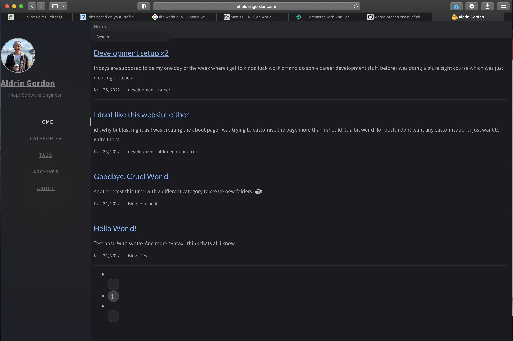

im going to build my site from the ground up with angular

i brought up the site today in safari on my 2013 macbook and it looks **terrible**

## the plan

deploy a basic angular template to netlify and work on it from there

once done change the dns settings to use aldringordon.com as the domain and deprecate this website

challenge: somehow keep these posts + metadata

## thoughts

i think doing it this way will let me just focus on one things at a time.

ideally id like to just have single a nice landing page thats my portfolio

i guess all this extra blog stuff i can create another website for, but i need to think of another name and probably buy the domain name asap